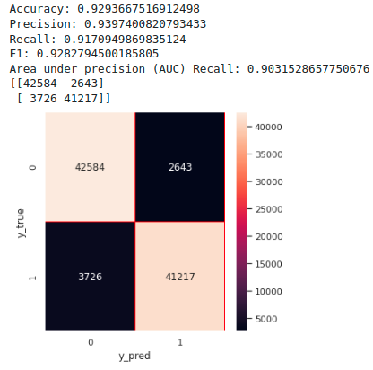
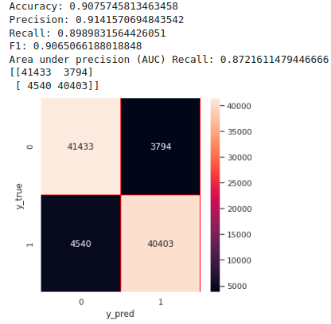
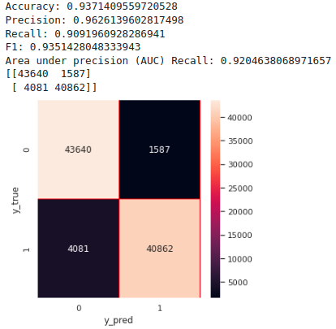

# TurkNetCustomerchurnPrediction

This repository provides an implementation of varipus machine learning algorithms for the customer churn prediction. The algorithms implemented : 

- Random Forest Classifier

- KNeighbors Classifier

- Decision Tree Classifier

- XGBoost Classifier

